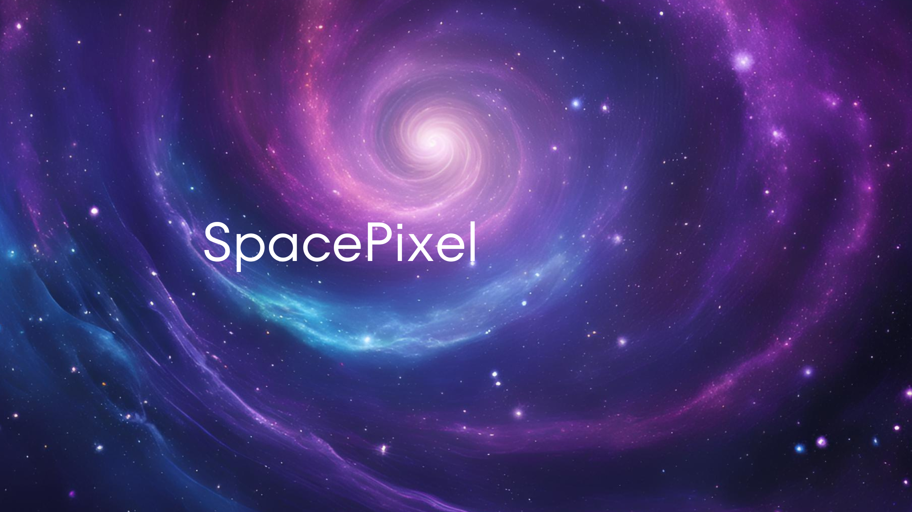

# Hi there, I'm Dimitar Stoev 👋🏻
### Product Builder • Software Engineer • Stoic

I am a software engineer and product owner obsessed with making ideas work. I focus on building practical applications that solve real-world problems, deliver great user experiences, and get delivered on time. 

I am a strong believer in open education and transparency, which is why **I build my business ventures and software projects completely in public.**

---

## 🚀 Active Projects

### 🧹 [SpotlessGiG](https://spotlessgig.com)
The largest open directory for independent cleaning professionals and boutique agencies in Bulgaria. It’s a zero-commission platform designed to connect homeowners directly with local cleaners, cutting out the middleman entirely so clients save money and cleaners keep 100% of their hard-earned wages.

### 🌌 [SpacePixel](https://spacepixel.app)
A specialized application designed specifically for astrophotographers to manage and process their night-sky photography.

---

## 📝 Writing & Sharing Knowledge

I love writing articles that break down complicated topics—whether it's software architecture or emerging technology—into simple, easy-to-digest concepts with a bit of humor thrown in. 

🔸 [How I structure my angular applications](https://www.stoev.dev/blog/how-i-structure-my-angular-applications)  
🔸 [What is Blockchain and my opinion for it's future](https://www.stoev.dev/blog/what-is-blockchain)  
🔸 [Angular view children and content children](https://www.stoev.dev/blog/angular-view-children-and-content-children)  
🔸 [Angular data binding](https://www.stoev.dev/blog/angular-data-binding)  
🔸 [Angular concept view in 5 minutes](https://www.stoev.dev/blog/angular-concept-view-in-5-minutes)  

You can read all my latest thoughts over on my personal blog at [stoev.dev](https://stoev.dev).

---

## 🏛️ Mindset & Philosophy

Outside of building software, I am deeply committed to **Stoicism** and personal development. I make it a point to practice mental discipline, focus on what is within my control, and tackle the daily grind of entrepreneurship with consistency and patience, one step at a time.

---

## 🤝 Let's Connect

Whether you want to discuss a potential project, talk about building apps, or just chat about philosophy, feel free to reach out!

📧 **Email:** [contact@stoev.dev](mailto:contact@stoev.dev)  

