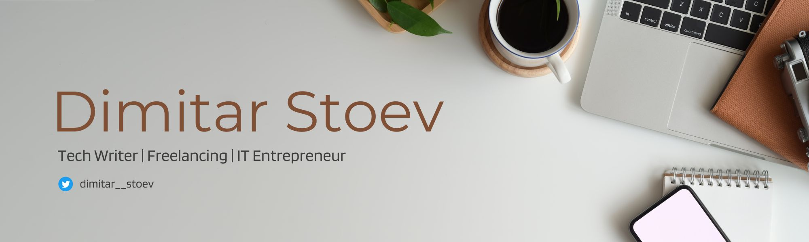

### Hi there 👋🏻

 

# More about me [Dimitar Stoev](https://stoev.dev)

My name is Dimitar Stoev, and I'm a software engineer with a passion for developing a wide range of applications, from web technologies and representative websites to mobile applications. I'm a productivity geek with a strong belief in the hustle culture, and I strive to get things done on time with a high-quality product spirit.

I'm a strong believer in open source and free education, and that's why I started the Open Source Society University. I'm excited to live in a time when access to value is so free and open, and I'm dedicated to giving back to the community.

I believe that understanding how technologies work and are implemented at a lower level is essential to providing better, high-quality service and consultation. That's why I prefer to work with serious technologies and write quality, well-tested code. My preferred stack includes Angular and VueJS on the frontend, and NestJS and Express.js on the backend.

Currently, I'm working on an open source SaaS CRM with options to create estimations and invoices, and I'm excited to share it with the community. My goal is to create a system that is easy to use, customizable, and integrates with popular payment gateways for easy payment processing. I'm always eager to connect with other developers and entrepreneurs, so feel free to reach out and say hi!

 

# Currently building..

<table>
  <tr>
    <td></td>
    <td></td>
  </tr>
</table>

### ✉️ Contact

Want to hear me? 
I'd love to chat!

<a href="mailto:contact@stoev.dev">contact@stoev.dev</a>

### 🔗 Let's Connect

 

