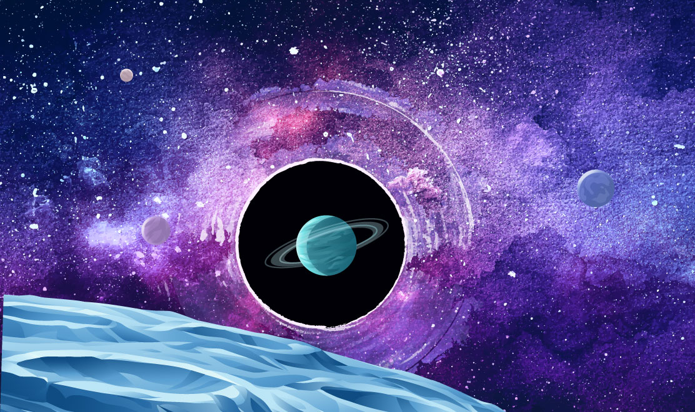

### Hi there 👋🏻

 

# More about me [Dimitar Stoev](https://stoev.dev)

My name is Dimitar Stoev, and I'm a software engineer with a passion for developing a wide range of applications, from web technologies and representative websites to mobile applications. I'm a productivity geek with a strong belief in the hustle culture, and I strive to get things done on time with a high-quality product spirit.

I'm a strong believer in open source and free education, and that's why I am building almost all my projects in public!

I believe that understanding how technologies work and are implemented at a lower level is essential to providing better, high-quality service and consultation. That's why I prefer to work with serious technologies and write quality, well-tested code. My preferred stack includes Angular and VueJS on the frontend, and NestJS and Express.js on the backend.

 

# Currently building..

<table>
  <tr>
    Artiscape Boutique - A platform for astrophotographers and space artist! Create your portfolio and share it with the world! A lot of features are planned!
  </tr>
   
  <tr>
    Click on the image and have a look - the code is also open source!
  </tr>
  <tr>
    
  </tr>
</table>

# Some of my articles

🔸 [How I structure my angular applications](https://www.stoev.dev/blog/how-i-structure-my-angular-applications)  
🔸 [What is Blockchain and my opinion for it's future](https://www.stoev.dev/blog/what-is-blockchain)  
🔸 [Angular view children and content children](https://www.stoev.dev/blog/angular-view-children-and-content-children)  
🔸 [Angular data binding](https://www.stoev.dev/blog/angular-data-binding)  
🔸 [Angular concept view in 5 minutes](https://www.stoev.dev/blog/angular-concept-view-in-5-minutes)  

I absolutely love writing articles, especially technical ones. Yes, I know it's not everyone's cup of tea, but there's just something about the challenge of explaining complex topics in a way that's easy for others to understand that gets me fired up.

Some people may find it a bit nerdy or boring, but for me, it's like solving a puzzle. The feeling of accomplishment I get when I finally figure out how to explain a difficult concept in a way that clicks for someone else is just priceless.

And let's not forget the humor - I mean, who doesn't love a good tech pun or two? Sometimes, when I'm writing, I like to throw in a joke or a witty comment just to keep things light and interesting.

But in all seriousness, writing technical articles is not just a passion of mine, it's also a way for me to share my knowledge with others and help them to understand the things that I find fascinating. It's a way for me to give back to the community and hopefully make a positive impact on the world. So yeah, you could say I'm a bit of a geek, but hey, someone's got to do it!

### ✉️ Contact

Want to hear me? 
I'd love to chat!

<a href="mailto:contact@stoev.dev">contact@stoev.dev</a>

### 🔗 Let's Connect

 

### Stoicism

I am a passionate believer in stoicism and spiritual and mental growth. I have read a lot of books on the topics and made myself a promise to try to be a real stoic.

And I think I am succeeding one step at a time.
